<p align="center">
  
</p>

<h1 align="center">Fonu</h1>

<p align="center"><strong>让 NAS 访问更简单</strong></p>

<p align="center">
  面向 <strong>飞牛 fnOS</strong> 的轻量公网访问管理工具<br />
  反向代理 · DDNS · HTTPS 证书 · 内网穿透 · 一站式 Web 管理
</p>

<p align="center">
  <a href="https://hub.docker.com/r/muxui/fonu"></a>
  
  
  
  
  
  <a href="https://www.gnu.org/licenses/gpl-3.0.html"></a>
</p>

---

## 简介

**Fonu** 是一款主要为 **飞牛 fnOS** 编写的反代与管理工具，帮助你在 NAS 上快速搭建稳定的公网访问能力：通过 Web 界面管理 Nginx 反向代理、自动同步 DDNS、申请与续期 Let's Encrypt 证书，并在一个仪表盘里查看服务状态、访问日志与流量统计。

无需手写 Nginx 配置，也无需在多个工具之间切换。当前开发与测试环境以飞牛 fnOS 为主，**群晖、威联通、自建 Linux 等其他环境尚未充分测试**，部署前请自行验证。

## 功能特性

| 模块           | 说明                                                                                           |
| -------------- | ---------------------------------------------------------------------------------------------- |
| **反向代理**   | 多域名、多端口、HTTP/HTTPS、自动重定向；实时访问日志、流量统计、当前连接 IP                    |
| **DDNS**       | 支持 Cloudflare、DNSPod、阿里云、腾讯云、火山引擎 DNS；单任务多根域名，自动同步公网 IP         |
| **HTTPS 证书** | ACME 自动申请与续期；证书/私钥/ZIP 下载；申请进度实时日志                                      |
| **仪表盘**     | 公网 IP、域名、证书、服务状态一览；请求趋势与运行健康度                                        |
| **日志中心**   | 系统日志、Nginx 访问日志、Nginx 错误日志；分页筛选与自动刷新                                   |
| **内网穿透**   | FRP 客户端：Nginx Web 网关穿透 + 独立 TCP 隧道（SSH/数据库等）；连接设置与隧道可分开保存后启动 |
| **系统设置**   | 常规 / 通知 / 安全 / 高级分栏；邮件/Webhook/Telegram 告警、备份与恢复                          |
| **其他**       | 深色模式、配置导出/导入、GitHub Release 更新提示                                               |

## 界面展示

<table>
  <tr>
    <td align="center" width="50%">
      <b>仪表盘</b><br>
      <a href="docs/screenshots/dashboard.png">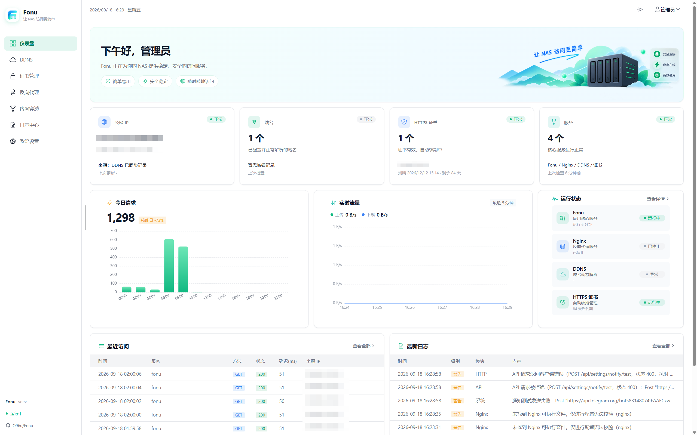</a>
    </td>
    <td align="center" width="50%">
      <b>DDNS</b><br>
      <a href="docs/screenshots/ddns.png">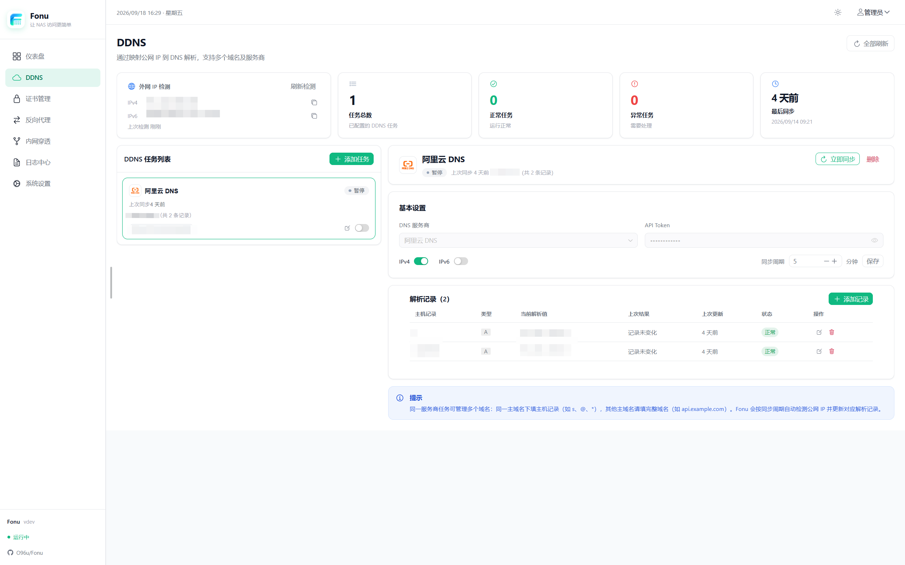</a>
    </td>
  </tr>
  <tr>
    <td align="center">
      <b>HTTPS 证书</b><br>
      <a href="docs/screenshots/certificates.png">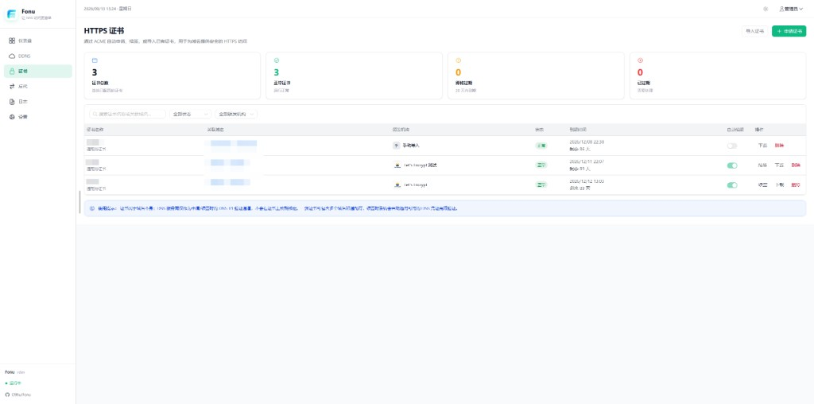</a>
    </td>
    <td align="center">
      <b>HTTPS 证书 · 申请向导</b><br>
      <a href="docs/screenshots/certificates-apply.png">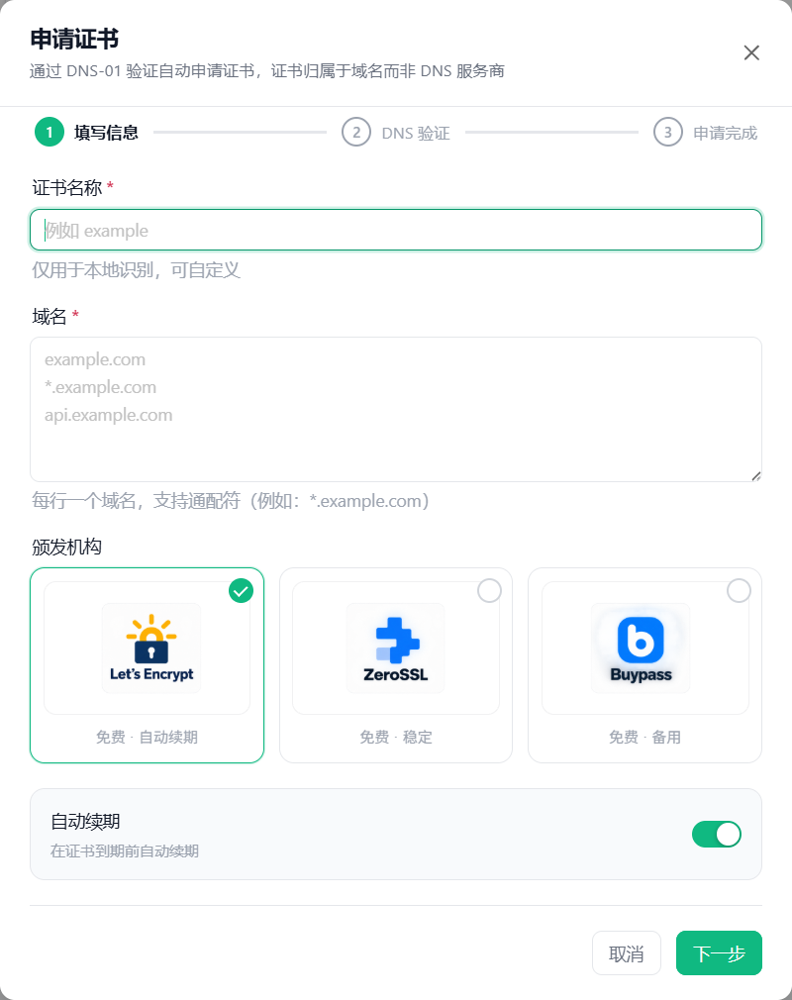</a>
    </td>
  </tr>
  <tr>
    <td align="center">
      <b>反向代理</b><br>
      <a href="docs/screenshots/proxy.png">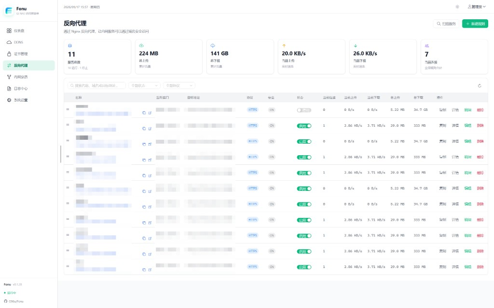</a>
    </td>
    <td align="center">
      <b>反向代理 · 规则详情</b><br>
      <a href="docs/screenshots/proxy-detail.png">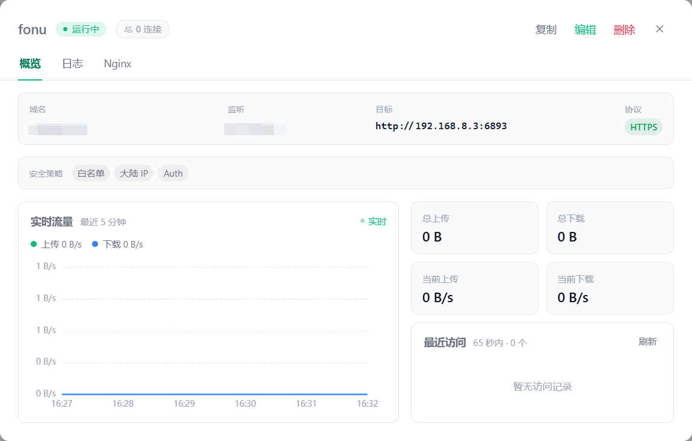</a>
    </td>
  </tr>
  <tr>
    <td align="center">
      <b>反向代理 · 规则配置</b><br>
      <a href="docs/screenshots/proxy-rule-basic.png">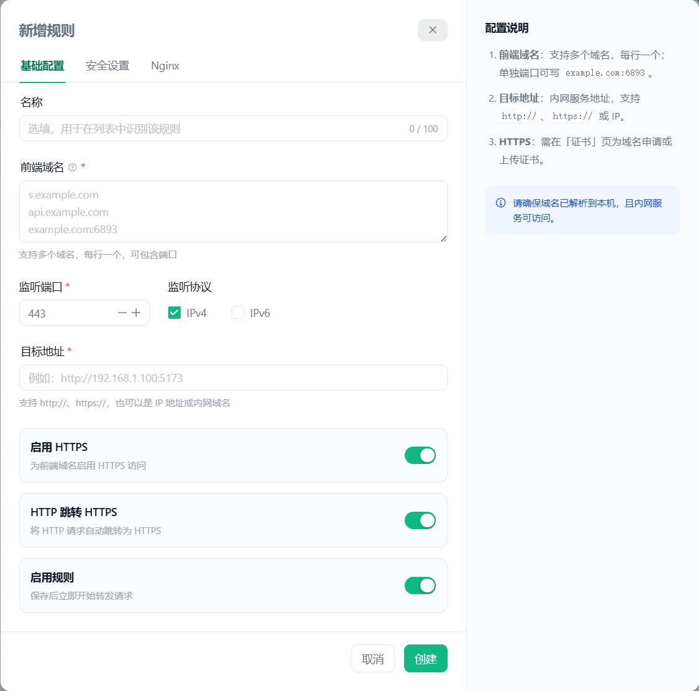</a>
    </td>
    <td align="center">
      <b>反向代理 · 安全设置</b><br>
      <a href="docs/screenshots/proxy-rule-security.png">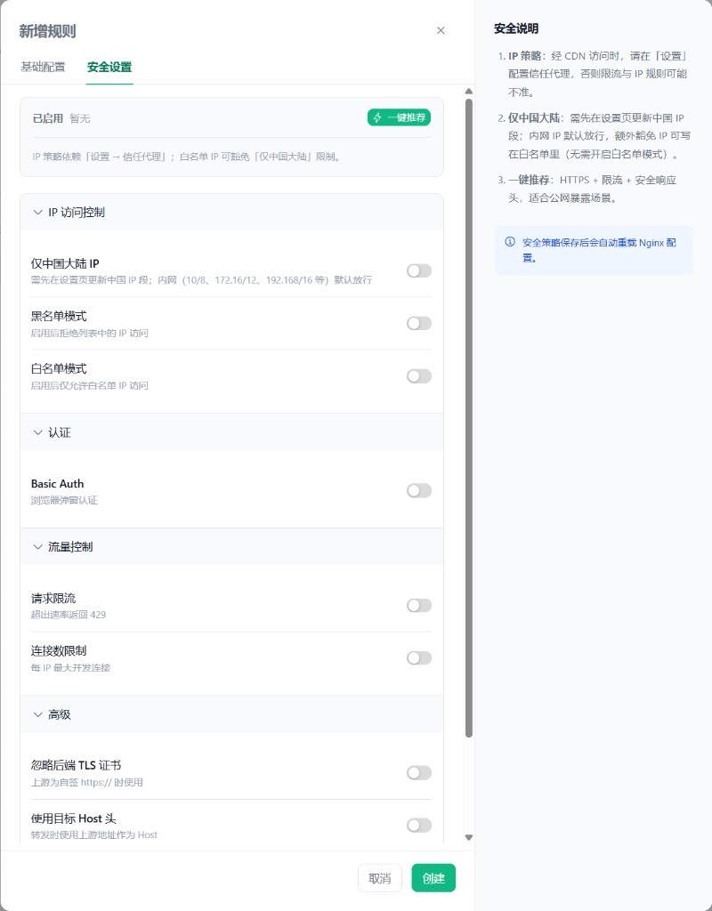</a>
    </td>
  </tr>
  <tr>
    <td align="center">
      <b>反向代理 · Nginx 配置</b><br>
      <a href="docs/screenshots/proxy-rule-nginx.png">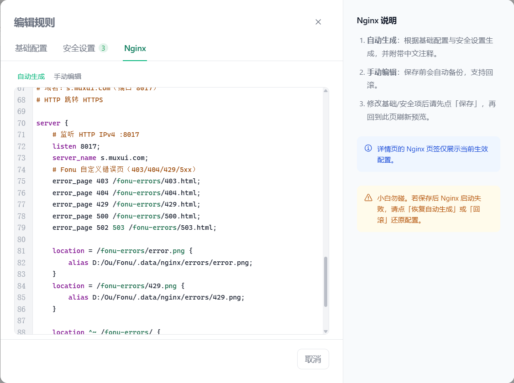</a>
    </td>
     <td align="center" colspan="2">
      <b>日志中心</b><br>
      <a href="docs/screenshots/logs.png">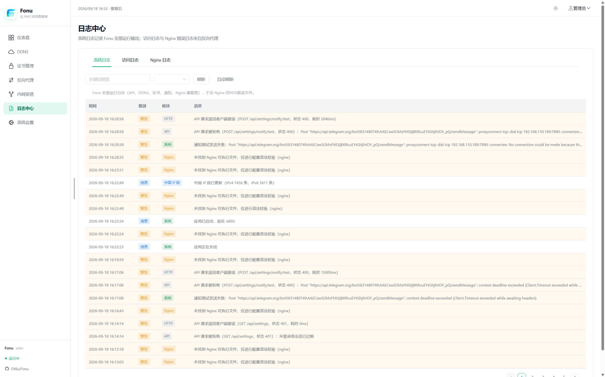</a>
    </td>
  </tr>
  <tr>
  <td align="center">
      <b>内网穿透 · Web 网关</b><br>
      <a href="docs/screenshots/frp.png">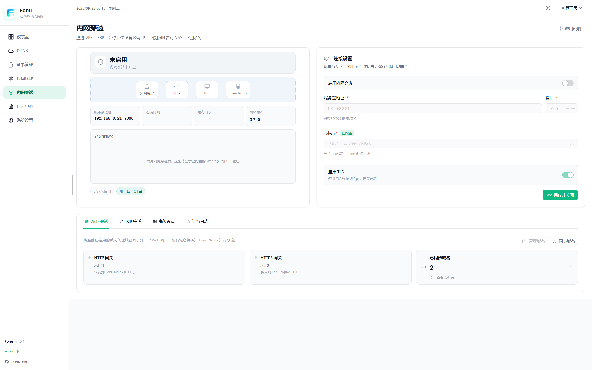</a>
    </td>
    <td align="center" colspan="2">
      <b>内网穿透 · TCP 转发</b><br>
      <a href="docs/screenshots/frp-tcp.png">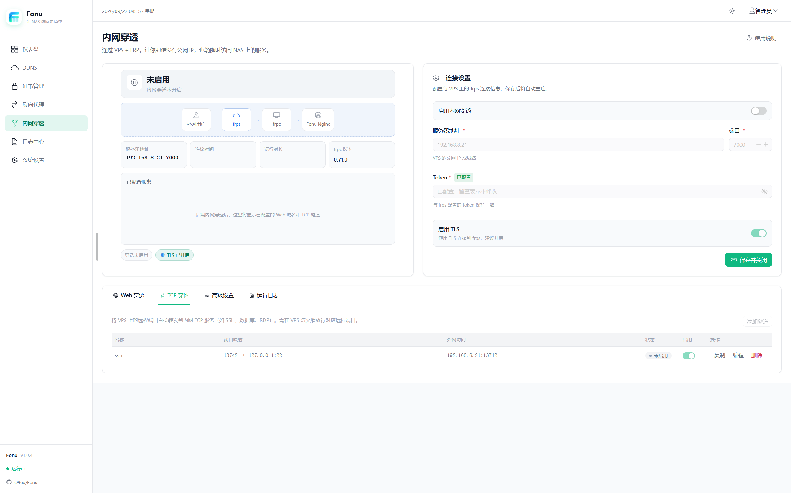</a>
    </td>
  </tr>
  <tr>
    <td align="center">
      <b>系统设置</b><br>
      <a href="docs/screenshots/settings.png">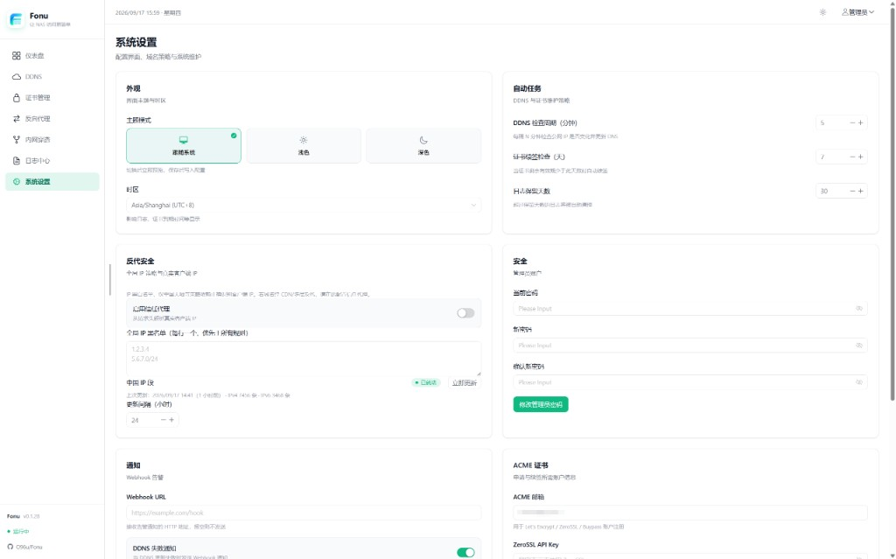</a>
    </td>
    <td align="center">
      <b>系统设置 · 高级</b><br>
      <a href="docs/screenshots/settings-advanced.png">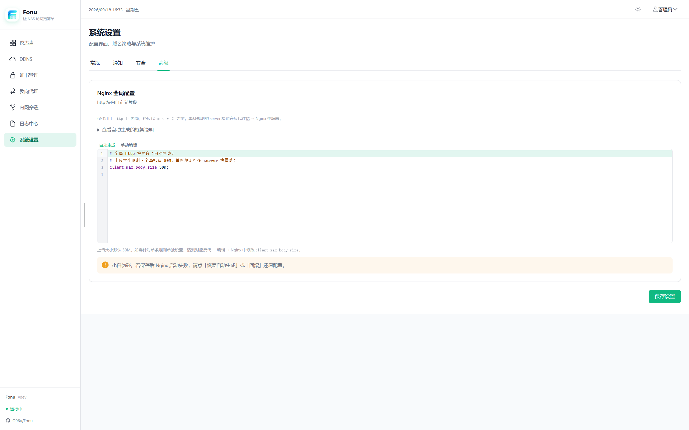</a>
    </td>
  </tr>
</table>

## 技术栈

| 层级         | 技术                                                                   |
| ------------ | ---------------------------------------------------------------------- |
| **后端**     | Go 1.23、标准库 HTTP、SQLite（modernc.org/sqlite）                     |
| **反向代理** | 内置 Nginx（动态生成配置、热重载）                                     |
| **证书**     | go-acme/lego（Let's Encrypt）                                          |
| **DDNS**     | Cloudflare / DNSPod / 阿里云 / 腾讯云 / 火山引擎 DNS API               |
| **内网穿透** | 内置 frpc（v0.71.x）；Web 网关穿透 Fonu Nginx，另支持 TCP 远程端口映射 |
| **前端**     | Vue 3、TypeScript、Vite、Naive UI、ECharts                             |
| **部署**     | Docker 多架构镜像（amd64 / arm64）、GitHub Actions CI                  |

## 部署

Docker 镜像：[hub.docker.com/r/muxui/fonu](https://hub.docker.com/r/muxui/fonu)

### 快速部署（推荐 · 飞牛 fnOS · Host 模式）

飞牛系统已占用 **80/443**，使用 **host 网络** + **高位反代端口**，避免与系统 Nginx 冲突。

```bash
docker run -d \
  --name fonu \
  --net=host \
  -v ./data:/data \
  --restart unless-stopped \
  muxui/fonu:latest
```

| 入口               | 地址                    |
| ------------------ | ----------------------- |
| 管理后台           | `http://<NAS-IP>:6893`  |
| HTTP 反代（默认）  | `http://<NAS-IP>:18080` |
| HTTPS 反代（默认） | `https://<NAS-IP>:9443` |

- `./data` 挂载后自动作为数据目录，存放数据库、Nginx 配置、证书与日志
- 飞牛系统已占用 80/443，容器默认反代端口为 `18080`、`9443`，可通过环境变量修改

### 其他部署方式

<details>
<summary>Docker Compose</summary>

```bash
FONU_SESSION_SECRET=your-secret docker compose -f docker-compose.host.yml up -d
```

</details>

<details>
<summary>Bridge 网络（端口映射，非飞牛环境可自行尝试）</summary>

```bash
docker pull muxui/fonu
FONU_SESSION_SECRET=your-secret docker compose -f docker-compose.hub.yml up -d
```

</details>

<details>
<summary>本地构建</summary>

```bash
docker compose up -d --build
```

</details>

### 首次登录

1. 启动后查看容器/运行日志，获取自动生成的 **admin 初始密码**
2. 访问 `http://<NAS-IP>:6893/login` 登录
3. 在 **设置** 中立即修改管理员密码

### FRP 内网穿透（无公网 IP）

适用于无法端口映射、无公网 IPv4 的场景。Fonu 内置 **frpc**，在 **内网穿透** 页面统一管理：

- **Web 网关**：外网 HTTP/HTTPS 经 VPS 上的 frps 中转至本地 Fonu Nginx（默认 `18080` / `9443`），域名分流、证书、访问控制、日志仍由 Nginx 处理
- **TCP 转发**：将 VPS 上的远程端口映射到内网 TCP 服务（如 SSH `22`、数据库）；可与 Web 网关同时启用，纯 TCP 场景可不配置穿透域名
- **连接设置**：填写 frps 地址、端口、Token、TLS；可先保存连接信息，待配置 Web 域名或 TCP 隧道后再启动 frpc

**Web 流量路径**：用户 → DNS（解析到 VPS）→ frps → frpc → Fonu Nginx → 内网服务

**TCP 流量路径**：用户 → VPS 公网 IP:远程端口 → frps → frpc → 内网 `IP:端口`

#### 1. VPS 部署 frps

在具有公网 IP 的 VPS 上安装 [frp](https://github.com/fatedier/frp)（建议 **v0.71.x**，与 Fonu 内置 frpc 同版本）。Fonu **高级设置** 中可查看根据当前连接与 TCP 隧道自动生成的 `frps.toml` 参考（含 `allowPorts` 等）。

典型 Web 网关示例：

```toml
bindAddr = "0.0.0.0"
bindPort = 7000

auth.method = "token"
auth.token = "your-secret-token"

vhostHTTPPort = 80
vhostHTTPSPort = 443
```

启动：`frps -c frps.toml`。安全组/防火墙需放行 **7000**（控制连接）、**80/443**（Web 虚拟主机），以及 **TCP 隧道使用的远程端口**（在 Fonu 页面添加 TCP 规则后按提示放行）。

#### 2. Fonu 配置 frpc

在侧栏 **内网穿透** 页面：

1. **连接设置**：FRP 服务器地址 / 端口（默认 7000）、与 frps 一致的 Token、是否启用 TLS
2. **Web 穿透**：从反向代理同步域名，或手动维护「已同步域名」；保存后创建 HTTP → Nginx HTTP 端口、HTTPS → Nginx HTTPS 端口隧道
3. **TCP 转发**：添加隧道（名称、VPS 远程端口、内网目标地址），单独启停

启用内网穿透并保存后，Fonu 自动生成 `frpc.toml` 并启动 frpc。**运行日志** Tab 与 **日志中心 → FRP** 可查看 frpc 输出。

#### 3. DNS 与证书

- **DDNS**：启用 FRP 后，Web 域名应解析到 **VPS 公网 IP**，而非 NAS IP（DDNS 页会有提示）
- **HTTPS 证书**：Web 网关推荐继续使用 **DNS-01** 验证（Cloudflare、阿里云、腾讯云、DNSPod、火山引擎等已支持）；证书仍在 NAS 侧 Nginx 终结
- **纯 TCP**：无需为 TCP 隧道单独配置域名证书

## 环境变量

| 变量                    | 默认值                    | 说明                                       |
| ----------------------- | ------------------------- | ------------------------------------------ |
| `FONU_LISTEN`           | `:6893`                   | 管理后台监听地址                           |
| `FONU_DATA_DIR`         | `/data`                   | 数据目录（数据库、Nginx 配置、证书、日志） |
| `FONU_SESSION_SECRET`   | `change-me-in-production` | 会话加密密钥，生产环境请自行修改           |
| `FONU_NGINX_HTTP_PORT`  | `80`                      | 新建 HTTP 反代规则的默认监听端口           |
| `FONU_NGINX_HTTPS_PORT` | `443`                     | 新建 HTTPS 反代规则的默认监听端口          |
| `FONU_NGINX_BIN`        | `nginx`                   | Nginx 可执行文件路径（本地开发可指定）     |
| `FONU_FRPC_BIN`         | `frpc`                    | frpc 可执行文件路径（Docker 镜像内置）     |
| `FONU_FRP_PID`          | `{DATA_DIR}/frp/frpc.pid` | frpc 进程 PID 文件路径                     |

## 注意事项

1. **生产环境务必设置** `FONU_SESSION_SECRET`，不要使用默认值。
2. **端口冲突**：宿主机已有 Nginx（如飞牛系统）占用 80/443 时，不要让 Fonu 反代规则监听 80/443；使用 `18080/9443` 或 host 模式 + 环境变量。
3. **已有反代规则**：修改 `FONU_NGINX_HTTP_PORT` / `FONU_NGINX_HTTPS_PORT` 后，**不会自动更新**数据库中已有规则的端口，需在反代页手动修改并保存。
4. **访问日志**：仅统计经 Fonu Nginx 反代的域名流量，不包含管理后台 `:6893` 的请求。
5. **证书与 DNS**：HTTPS 申请前请确保域名 DNS 已解析到本机，且 DDNS 凭证能管理对应根域。
6. **数据持久化**：Docker 部署请挂载 volume 到 `FONU_DATA_DIR`，避免容器重建后配置丢失。
7. **备份**：可通过设置页导出配置；重要证书与数据库建议定期备份 `FONU_DATA_DIR` 目录。

## 本地开发

```bash
# 前端热更新
cd web && npm ci && npm run dev

# 后端（需先把 web/dist 复制到 cmd/fonu/web/dist）
cd web && npm run build
go run ./cmd/fonu

# 测试
go test ./...
cd web && npm run typecheck
```

发版版本号以 Git tag 与 `web/package.json` 为准；Docker / CI 通过构建参数注入，本地 `go run` 默认显示 `dev`。

## 开源协议

本项目采用 [GPL-3.0](https://www.gnu.org/licenses/gpl-3.0.html) 开源。
